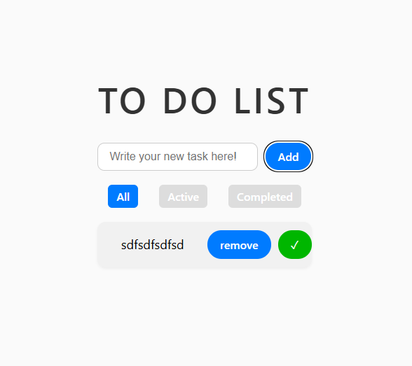

# 📝 React To-Do List

This project demonstrates real-world usage of components, custom hooks, state management, and UI logic.

## 🚀 Features

- Add new tasks
- Mark tasks as completed or active
- Delete tasks
- Filter by status: All / Active / Completed
- Simulated loading on start (with `useEffect`)
- Fully typed with TypeScript
- Clean architecture with custom hook `useTasks`

## 📁 Project Structure

```
src/
├─ components/
│  ├─ TaskForm.tsx
│  ├─ TaskList.tsx
│  └─ TaskItem.tsx
├─ hooks/
│  └─ useTasks.ts
├─ App.tsx
├─ main.tsx
└─ index.css
```

## 🧪 Technologies

- React
- TypeScript
- Vite
- CSS (vanilla)

## 🖼 Screenshot

 

## 🌐 Live Demo

[Click here to see the live version](https://react-to-do-list-dun.vercel.app/)
